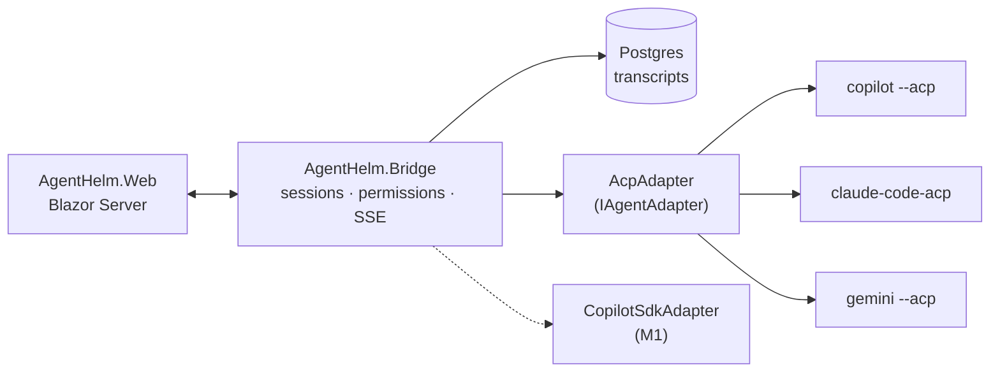

# AgentHelm

[](https://github.com/konradcinkusz/agenthelm/actions/workflows/build-containers.yml)
[](https://github.com/konradcinkusz/agenthelm/actions/workflows/ci.yml)
[](LICENSE)
[](https://github.com/konradcinkusz/agenthelm/releases/latest)
[](https://github.com/konradcinkusz/agenthelm/releases)
[](https://github.com/konradcinkusz/agenthelm/stargazers)
[](https://github.com/konradcinkusz/agenthelm/pkgs/container/agenthelm-bridge)
[](https://dotnet.microsoft.com/download/dotnet/8.0)

**A web cockpit for AI coding agents.** One GUI to drive GitHub Copilot CLI,
Claude Code, Gemini CLI — and any of the ~50 agents speaking the
[Agent Client Protocol](https://agentclientprotocol.com) — with transparent
transcripts, explicit tool permissions, and an audit trail.

> Sibling project of [CopilotScope](https://github.com/konradcinkusz/copilotscope):
> **Scope observes** (what was that session worth?), **Helm steers** (run the
> session, approve the tools, keep the record). Same stack, opposite direction
> of the arrow.

**Status: M3 (feature-complete for the planned roadmap)** — sessions,
streamed chat, permission policies (ask / auto-read / YOLO), session resume
(ACP `session/load`), history browser, git diff viewer with accept/reject,
integrated terminal (**PTY on Unix**, xterm.js), image & file attachments,
**agent handoff**, **per-agent capability hints**, and **CopilotScope quality
scores inline**. See the [roadmap](#roadmap) for what remains beyond.

---

## Quick start

Prerequisites: .NET 8 SDK **8.0.303 or newer** (Aspire ships as a NuGet
MSBuild SDK — no `aspire` workload; if you installed it in the past you can
`dotnet workload uninstall aspire`). Docker only if you want persistent
history (Postgres); everything else runs without it.

### Option 0 — containers, no clone (GHCR)

Each GitHub release publishes two images to GHCR (see `.github/workflows/build-containers.yml`).
Users don't need the repository at all:

```bash
# Linux / macOS / Git Bash:
curl -O https://raw.githubusercontent.com/konradcinkusz/agenthelm/master/docker-compose.ghcr.yml
# Windows PowerShell:
curl.exe -O https://raw.githubusercontent.com/konradcinkusz/agenthelm/master/docker-compose.ghcr.yml

docker compose -f docker-compose.ghcr.yml up
```

UI at **http://localhost:5200** · Bridge API at **http://localhost:5199**.

One-time setup after the first workflow run: GHCR packages start private —
switch each package to **public** (GitHub → Packages → package → Settings)
so anonymous `docker pull` works.

> **Constraint:** ACP agents (Copilot CLI, Claude Code, Gemini) run as local
> subprocesses and cannot reach your host environment from inside a container.
> The built-in **echo agent** is included in the Bridge image and works out of
> the box. For real agents use Option A or B below.

### Option 0b — release zip (no build)

Download the latest zip from Releases, unpack, then `./run.sh` (or
`.\run.ps1`). Bridge starts on `127.0.0.1:5199`, the UI on
`127.0.0.1:5200`, and the built-in echo agent works out of the box. Requires
only the .NET 8 ASP.NET Core *runtime*.

### Option A — Aspire (recommended)

```bash
dotnet run --project src/AgentHelm.AppHost
```

Starts Postgres (container, persistent volume), the Bridge (local process —
this is deliberate, see [Why local](#why-the-bridge-runs-on-your-machine)),
and the web UI. Open the URL Aspire prints for `web`.

### Option B — no Docker, no Aspire

```bash
dotnet run --project src/AgentHelm.Bridge   # API on http://127.0.0.1:5199
dotnet run --project src/AgentHelm.Web      # UI (memory-only history)
```

### First session in 30 seconds — no agent required

AgentHelm ships with a built-in **echo** agent that speaks ACP, so you can see
the whole loop before installing anything:

1. Click **＋ New**, pick *Echo (built-in demo agent)*, set any existing
   directory as the working directory, **Start session**.
2. Type a prompt — watch it stream back.
3. Type a prompt containing the word **"tool"** — the agent will request
   permission to run a tool, and the amber banner appears. Allow or reject;
   both decisions land in the transcript as audit entries.

### Real agents

| Agent | Requirement | Catalog entry (preconfigured) |
|---|---|---|
| GitHub Copilot CLI | `copilot` on PATH, logged in (`copilot login`), Copilot subscription | `copilot --acp --stdio` |
| Claude Code | Node.js; adapter fetched via npx | `npx @zed-industries/claude-code-acp` |
| Gemini CLI | `gemini` on PATH, authenticated | `gemini --acp` |

Add or change agents in `src/AgentHelm.Bridge/appsettings.json` under
`AgentHelm:Agents` — any ACP-speaking command works:

```json
{ "Id": "myagent", "Name": "My Agent", "Command": "my-agent", "Args": ["--acp"], "Type": "acp" }
```

`Type` selects the adapter: `acp` (default) or `copilot-sdk` (requires the
`COPILOT_SDK` build symbol and the GitHub Copilot SDK preview package —
without them, starting such an agent fails with instructions, not silence).
`Args` is optional.

> **Copilot CLI churn warning:** the CLI has previously removed a programmatic
> interface without deprecation (github/copilot-cli#1606). If the `copilot`
> entry stops working after an auto-update, pin the CLI version and run with
> `--no-auto-update`.

---

## What M0 gives you

- **Multi-agent by protocol, not by plugins** — one ACP client covers the
  whole registry; agents are configuration, not code.
- **Permission gateway with policies and an audit trail** — every tool call
  runs through the policy engine: `ask` (default — every call is a decision),
  `auto_read` (read-only kinds auto-allowed; network `fetch` deliberately NOT,
  since a fetch can exfiltrate what a read just loaded), or `yolo`
  (everything auto-allowed — explicit per-session confirmation required).
  Every decision — human or automatic — lands in the transcript as an audit
  entry. No handler wired up means *reject by default*, never silent approval.
- **Session resume (CLI ↔ GUI continuity)** — archived sessions carry the
  agent-side session id; one click resumes them via ACP `session/load`, and
  the agent replays the conversation into the transcript. Works with any
  agent advertising the `loadSession` capability (the built-in echo agent
  demonstrates it).
- **History browser** — the rail's History view lists archived sessions from
  Postgres with a read-only transcript viewer and the Resume button.
- **Git diff viewer (Changes tab)** — working-tree changes vs HEAD with
  per-file diffs and +/− counts. **Accept** stages the file (`git add`);
  **Reject** makes it not have happened (`git checkout HEAD --` for tracked
  files, delete for untracked — the tracked/untracked decision is re-derived
  server-side, never trusted from the request). Both actions are audited in
  the session transcript, and every path is guarded to the session cwd.
- **Integrated terminal (Terminal tab)** — a shell next to the agent session,
  rendered by xterm.js, with "→ Prompt" to attach recent output to the chat
  composer. Honest scope note: this is a shell *pipe*, not a PTY — full-screen
  TUI apps won't render, and some tools disable colors when they detect no
  TTY. The actual use case (run commands, feed output to the agent) works.
  **M3 upgrade:** on Unix systems with util-linux `script` available, the
  shell now runs inside a real PTY (`script -qfe -c bash /dev/null`) —
  interactive prompts, colors and line editing work, and the UI stops
  local-echoing since the PTY echoes itself. Windows stays on the pipe.
- **Attachments** — images (sent as ACP `image` content blocks) and text
  files (embedded as `resource` blocks) travel with the prompt; up to 4 files,
  2 MB each, binary non-image files are refused client-side.
- **Session rename** — the pencil next to the title; Enter saves, Escape
  cancels, the change propagates live and persists with the snapshot.
- **Agent handoff** — continue a conversation with a different agent: Helm
  opens a new session in the same directory and prefills its composer with a
  compact, attributed summary of the conversation so far. The summary is
  **never auto-sent** — you see exactly what the next agent will read, then
  you press Send. The source session gets an audit entry.
- **Capability hints** — chips in the session header (resume / images /
  files) parsed from the agent's ACP `initialize` response; the attach button
  warns when the agent advertises no attachment support.
- **CopilotScope inline** — the Scope button shows quality scores of Scope
  sessions whose activity overlaps this session (`AgentHelm:Scope:BaseUrl`,
  default `http://localhost:4318`). Honest caveat, also shown in the UI: the
  match is time-based best-effort — exact correlation needs telemetry tagging
  (a Beyond-M3 item on both projects). When Scope is down, the panel says so
  and Helm backs off for a minute instead of hammering a dead endpoint.
- **Sandboxed file access** — ACP `fs/read_text_file` / `fs/write_text_file`
  are honored only inside the session's working directory. The Bridge is the
  security boundary, not the UI.
- **Live transcript** — streamed chunks over SSE, tool calls inline,
  clean record of every step.
- **History that survives restarts** — sessions snapshot to Postgres
  (write-behind, 1 s); without Postgres the Bridge degrades gracefully to
  memory-only.

### Troubleshooting: "Aspire Workload has been deprecated"

That error means the tooling tried to resolve the old workload. This repo
already uses the SDK-based setup (`<Sdk Name="Aspire.AppHost.Sdk" .../>` in
`AgentHelm.AppHost.csproj`), which requires .NET SDK 8.0.303+. If you still
see the error: update the .NET SDK, optionally remove the stale workload
(`dotnet workload uninstall aspire`), and note that the Sdk element version
and the `Aspire.Hosting.*` package versions must always be bumped together.

## Security model

- Bridge binds to `127.0.0.1` only. Exposing it further is your explicit,
  configured decision (`AgentHelm:Urls`) — never a default.
- Optional shared token (`AgentHelm:ApiToken` + `x-helm-token` header). Worth
  enabling even on loopback: any web page open in your browser can fire
  requests at localhost.
- Agents only touch files under the session working directory (hard path
  guard in the ACP client); the git endpoints enforce the same guard.
- The Terminal tab executes arbitrary shell commands **as you, on your
  machine** — it is exactly as powerful as your own terminal. It rides the
  same loopback bind and `x-helm-token` gate as everything else; that gate is
  worth enabling if anything beyond your browser can reach the port.
- YOLO is never a default and never silent: enabling it requires an explicit
  per-session confirmation click, and every auto-decision is still audited.
  Policies can only auto-ALLOW — rejection is always a human decision.

## Why the Bridge runs on your machine

ACP agents are local subprocesses (the remote transport is still an RFC), and
they need your repositories and your auth. Aspire therefore orchestrates the
Bridge and Web as **local processes** and only Postgres as a container. This
is an architectural constraint of the ecosystem today, not a shortcut.

## Architecture



The `IAgentAdapter` seam keeps protocol churn out of the product: sessions,
permissions, persistence and UI never see protocol details. The GitHub
Copilot SDK adapter (richer Copilot features: model selection, resume, custom
agents, native OTel config pointing at CopilotScope) plugs into the same seam
in M1.

## Roadmap

| Milestone | Scope |
|---|---|
| **M0 — skeleton** ✅ | ACP adapter, sessions, streamed chat, permission gateway + audit, Postgres history, built-in echo agent |
| **M1 — control** ✅ | Permission policies (ask / auto-read / YOLO with explicit opt-in), session resume via `session/load`, history browser with read-only viewer, Copilot SDK adapter skeleton (gated behind `COPILOT_SDK` — the SDK is preview and needs NuGet; see `Agents/CopilotSdk/CopilotSdkAdapter.cs` for the four TODOs and activation steps) |
| **M2 — workbench** ✅ | Git diff viewer with accept/reject (audited), integrated terminal (xterm.js over a shell pipe), image & text attachments as ACP content blocks, per-session model plumbing (used by SDK agents; ACP agents pick their own default) |
| **M3 — multi-agent polish** ✅ | Agent handoff between sessions (prefilled, user-sent context), per-agent capability hints from `initialize`, CopilotScope quality scores inline (time-window correlation), adapter factory by `Type` (`acp` / `copilot-sdk`) so SDK activation is just the `COPILOT_SDK` symbol + preview package + four TODOs, PTY terminal on Unix via `script(1)` |
| **Beyond** | Copilot SDK adapter finish (needs the preview NuGet on a networked machine), exact Scope correlation via telemetry tagging, ConPTY for Windows, git worktrees, system-message overrides, plugins, canvas |

## Tests

The real test project uses xunit (`tests/AgentHelm.Tests`). The suite (41
tests) covers the ACP protocol client (framing, streaming order, permission
round-trips, path guard, error propagation, `session/load` replay, attachment
content blocks), the session layer (transcript, blocking permission flow with
audit, event fan-out), the policy engine (kind taxonomy, allow-once
preference, no-auto-reject invariant, YOLO auditing), the git service
(porcelain parsing incl. rename token consumption, diff counting, path guard,
tracked-vs-untracked reject — plus a real end-to-end test against an actual
git repo), the terminal (real shell echo round-trips in both pipe and PTY
mode), agent capability parsing, the adapter factory (clear activation errors
for `copilot-sdk` without the flag), handoff context building (attribution +
front-trimming), and the Scope integration (tolerant DTO parsing, time-window
correlation). The factory tests caught a real bug: the configuration binder
silently drops agents declared without an `Args` section — fixed by making
`Args` an init property with a default.

```bash
dotnet test
```

## Contributing

See [CONTRIBUTING.md](CONTRIBUTING.md) for the dev setup, project layout, architecture notes, and how to submit a PR.

## License

MIT — see [LICENSE](LICENSE).
