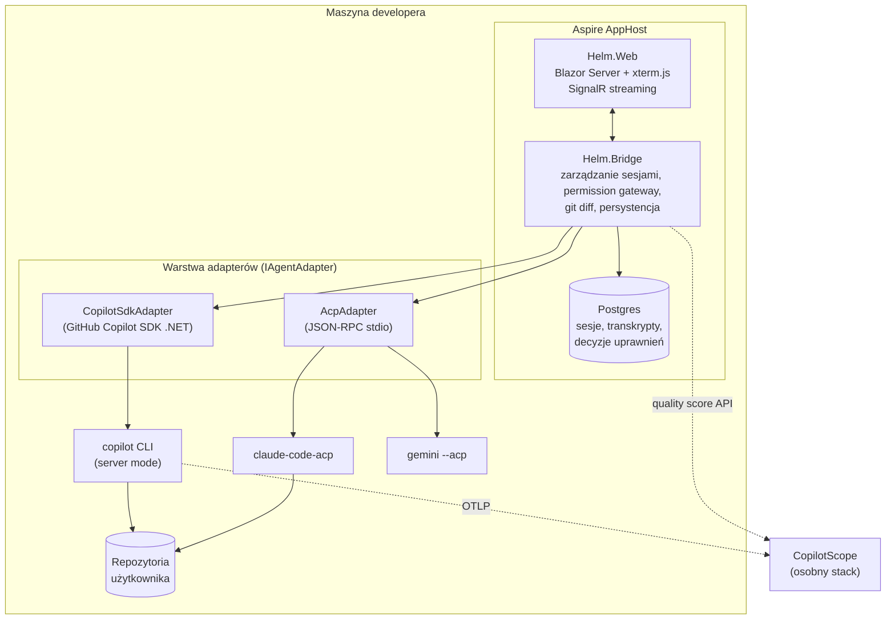

# AgentHelm — analiza projektu (GUI dla Copilot CLI i agentów kodujących)

> Robocza nazwa: **AgentHelm** („ster") — celowo bez „Copilot" w nazwie, bo cel
> końcowy to wiele agentów, a para nazw *Scope* (obserwacja) + *Helm* (ster)
> opowiada jedną historię: **CopilotScope mierzy wartość sesji, AgentHelm nią steruje.**
> Nazwa do decyzji — alternatywy: AgentDeck, HelmBoard, PilotDeck.

---

## 1. Wizja i relacja do CopilotScope

Dwa równoległe rozwiązania to **poprawna architektura produktowa**, pod warunkiem
że granica jest ostra:

| | CopilotScope | AgentHelm |
|---|---|---|
| Rola | **Płaszczyzna obserwacji** (read-only) | **Płaszczyzna sterowania** (interaktywna) |
| Wejście | Telemetria OTLP, którą klienci i tak emitują | Sesje agentów sterowane przez SDK/ACP |
| Pytanie | „Czy to było warte spalonych tokenów?" | „Prowadź sesję: prompty, uprawnienia, diffy" |
| Ryzyko | Niskie (pasywny odbiornik) | Wysokie (wykonuje narzędzia na maszynie usera) |
| Stan | ~90% gotowe, publiczne repo | Greenfield |

**Synergie (dlatego dwa projekty, jedna platforma):**
- Wspólny stack: Aspire + Blazor + Postgres + GHCR + ten sam design system
  (instrument-panel, ink/copper) — drugi projekt startuje z gotowym szkieletem.
- AgentHelm **konfiguruje telemetrię agentów tak, by celowała w CopilotScope**
  (SDK Copilota przyjmuje wprost `telemetry: TelemetryConfig` przy tworzeniu
  klienta) — użytkownik Helma dostaje Scope „za darmo".
- Helm może **osadzić wynik jakości ze Scope inline przy każdej sesji** (REST
  API Scope już istnieje) — żaden konkurent tego nie ma: Cockpit pokazuje
  zużycie tokenów, Helm+Scope pokaże *czy było warto*.
- Odwrotnie: frustration analyzer Scope zyskuje treść z Helma bez OTel content
  capture, bo Helm i tak ma pełny transkrypt sesji.

**Rekomendacja repo:** dwa osobne repozytoria (inna kadencja wydań, inny profil
ryzyka bezpieczeństwa), wspólny kontrakt telemetrii i ewentualnie wspólna paczka
UI-komponentów później, gdy duplikacja zacznie boleć.

---

## 2. Zweryfikowane opcje integracji z Copilot CLI (stan: lipiec 2026)

To jest fundament wykonalności — i wygląda **znacznie lepiej niż rok temu**,
bo nie trzeba nic skrobać z terminala:

| Opcja | Mechanizm | Ocena dla Helma |
|---|---|---|
| **GitHub Copilot SDK (.NET)** | Oficjalny SDK (preview), JSON-RPC do CLI w trybie serwera; **CLI bundlowane automatycznie w pakiecie .NET**; sesje create/resume/list/delete, streaming eventów, **permission handler** (approve/deny per tool call), custom tools, BYOK, wybór modelu, konfiguracja OpenTelemetry | ✅ **Ścieżka główna.** Dokładnie nasz stack; permission handler to gotowy fundament „fine-grained permissions" z Cockpita |
| **CLI headless server** | `copilot --headless --port 4321` — trwały serwer TCP, wielu klientów SDK współdzieli jeden serwer, domyślnie tylko loopback | ✅ Wariant deploymentu (kontener Helma → CLI na hoście) |
| **ACP** (`copilot --acp --stdio`) | JSON-RPC 2.0 po stdio wg Agent Client Protocol; Copilot w rejestrze ACP jako public preview | ✅ **Ścieżka multi-agent** — patrz §3 |
| `copilot -p "..."` one-shot | Nieinteraktywny pojedynczy strzał | ⚠️ Tylko do zadań batchowych (np. commit message) |
| PTY scraping | Pseudo-terminal + parsowanie outputu TUI | ❌ Odpada — kruchy; po to powstały SDK i ACP |

**Multi-agent przez ACP:** rejestr ACP obejmuje dziś ~50 agentów — Claude Code
(adapter Zed), Gemini CLI (natywnie `--acp`), Codex, GitHub Copilot (preview),
Cursor, Goose, Junie (JetBrains), OpenCode, Qwen Code… JetBrains jest
współmaintainerem protokołu obok Zed. ACP to dla agentów to, czym LSP dla
języków: **jedna implementacja klienta w Helmie = dostęp do całego rejestru.**

**Ograniczenie ACP, które kształtuje architekturę:** transport zdalny
(HTTP/WebSocket) jest wciąż w fazie RFC — każdy agent ACP działa dziś jako
**lokalny podproces**. Wniosek: backend Helma musi działać na maszynie, gdzie
żyją repozytoria i binarki agentów. Aspire orkiestruje to lokalnie idealnie;
dystrybucja „wszystko w Dockerze" wymaga montowania workspace'u i binarek —
realniejsza dystrybucja to `dotnet tool` / self-contained binary + opcjonalny
kontener Postgresa.

---

## 3. Architektura

**Kluczowe decyzje projektowe:**

1. **Dual-path adapterów od pierwszego dnia**: `CopilotSdkAdapter` (bogatsze
   funkcje: modele, resume, custom agents) + `AcpAdapter` (szerokość: każdy
   agent z rejestru). Wspólny interfejs `IAgentAdapter` — sesja, prompt,
   stream eventów, żądania uprawnień, cancel. To zabezpiecza też przed churnem
   SDK (patrz ryzyka): gdy SDK się łamie, ACP jest fallbackiem dla samego
   Copilota (`copilot --acp`).
2. **Permission gateway w Bridge, nie w UI**: każde żądanie narzędzia od
   agenta przechodzi przez centralny punkt decyzyjny z polityką
   (global / per sesja / per wzorzec narzędzia / YOLO z jawnym opt-in) i
   **audit-logiem w Postgresie**. To serce wartości Cockpita — i miejsce,
   gdzie „transparent & traceable" staje się faktem, nie hasłem.
3. **Terminal**: xterm.js w Blazorze (XtermBlazor) + PTY po stronie Bridge
   (ConPTY/openpty). Terminal jest *obok* czatu sesji — do komend usera —
   a nie kanałem sterowania agentem (od tego są SDK/ACP).
4. **Git diff viewer**: Bridge liczy diffy przez `git` w workspace (LibGit2Sharp
   lub proces git) i strumieniuje do UI; akceptacja/odrzucenie zmian per plik
   przed commitem.
5. **Persystencja jak w Scope**: snapshot sesji w jsonb, write-behind,
   rehydracja — wzorzec już przetestowany.

**Bezpieczeństwo (web-GUI wykonujące narzędzia = największa powierzchnia ryzyka):**
- bind wyłącznie do `localhost` domyślnie; dostęp zdalny tylko świadomie
  (reverse proxy + auth), nigdy out-of-the-box;
- token sesyjny UI↔Bridge nawet na loopbacku (obrona przed CSRF/drive-by
  z innych kart przeglądarki — strona w przeglądarce może strzelać w
  localhost!);
- YOLO mode wymaga jawnego, per-sesyjnego potwierdzenia i jest logowany;
- sekrety BYOK w OS keychain / DPAPI, nie w Postgresie.

---

## 4. MVP — cięcie zakresu

Lista feature'ów Cockpita to miesiące pracy. Cięcie na wydania, każde używalne:

| Etap | Zakres | Wynik |
|---|---|---|
| **M0 — szkielet** (1–2 tyg.) | Aspire + Blazor + Postgres; `CopilotSdkAdapter`; jedna sesja: prompt → streaming odpowiedzi → historia w Postgresie | „Rozmawiam z Copilotem przez własne GUI" |
| **M1 — kontrola** (2–3 tyg.) | Permission gateway z UI approve/deny + audit log; multi-sesja (lista, przełączanie, resume); wybór modelu | Rdzeń wartości: kontrola + przejrzystość |
| **M2 — warsztat** (2–3 tyg.) | Git diff viewer z accept/reject; terminal xterm.js; załączniki (obrazy/pliki do promptu) | Parytet z sednem Cockpita |
| **M3 — multi-agent** (2–3 tyg.) | `AcpAdapter` + Claude Code i Gemini CLI; przełącznik agenta per sesja | **Wyróżnik**: pierwszy web-GUI „każdy agent, jeden kokpit" |
| Później | Integracja quality score ze Scope inline; system message overrides; worktrees; pluginy; canvas | Roadmapa, nie MVP |

Świadomie **poza** MVP: canvas (Cockpit sam ma „partial"), pluginy, pełny
theming, CLI↔GUI continuity (wymaga zgłębienia formatu sesji CLI — badanie,
nie feature).

---

## 5. Pozycjonowanie vs Cockpit

| | Cockpit | AgentHelm |
|---|---|---|
| Platforma | .NET MAUI, **Windows 10+** (macOS „może, jeśli będzie popyt") | Web (Blazor) — Windows/macOS/Linux + dostęp zdalny do własnej maszyny |
| Agenci | GitHub Copilot CLI | Copilot SDK **+ ACP → ~50 agentów** |
| Licencja | (motywacja usera: pełna kontrola + MIT) | **MIT od pierwszego commita** |
| Telemetria | „OpenTelemetry diagnostics" — wykresy zużycia | **Oś wartości**: quality score per sesja przez CopilotScope |
| Model dystrybucji | Instalator desktop | `dotnet tool` / compose; Aspire dev-time |

Uczciwie o przewagach Cockpita: ma przewagę startu, gotowy polish UI,
społeczność. Nie ścigamy się na szybkość feature'ów — różnicujemy się na
**multi-agent (ACP)**, **web-first** i **integrację z osią wartości (Scope)**.
Klon 1:1 nie ma sensu; te trzy osie mają.

Uwaga prawna: inspiracja funkcjami jest w porządku, **zero kopiowania kodu,
assetów i tekstów** z Cockpita (clean-room). Nazwa bez „Cockpit".

---

## 6. Ryzyka — nazwane wprost

1. **Copilot SDK jest w preview i już raz złamał kompatybilność bez
   zapowiedzi** (usunięcie `--headless --stdio` na rzecz `--acp --stdio`
   wywróciło wszystkie wersje SDK; naprawa wymagała pinowania CLI). Mitygacja:
   pin wersji CLI + `--no-auto-update` w dystrybucji, adapter izoluje SDK od
   reszty, ACP jako fallback dla samego Copilota.
2. **ACP bez transportu zdalnego** — agenci to lokalne podprocesy; architektura
   „backend przy repo" jest wymuszona, nie wybrana. Gdy RFC remote-transport
   dojrzeje, Helm może zyskać tryb klient-serwer.
3. **Powierzchnia bezpieczeństwa**: GUI w przeglądarce wykonujące narzędzia na
   maszynie to wektor ataku (drive-by na localhost). Token + bind loopback +
   permission gateway to minimum, nie opcja.
4. **Scope creep**: lista Cockpita uwodzi. Dyscyplina M0–M3 albo projekt
   utknie w 70% jak większość klonów.
5. **Fokus**: CopilotScope jest na 90% i ma jutro pitch. Zalecenie: **najpierw
   domknąć i ogłosić Scope** (push, publiczne obrazy, krótki post techniczny),
   Helm zaczynać od M0 dopiero po tym. Dwa projekty na 70% są warte mniej niż
   jeden na 100% i jeden na 30%.

---

## 7. Werdykt

Tak — dwa równoległe rozwiązania to poprawny układ, a moment jest wyjątkowo
dobry: oficjalny .NET SDK Copilota usuwa najbrudniejszy problem (sterowanie
CLI), ACP z ~50 agentami daje realną ścieżkę do celu „wiele copilotów, jeden
kokpit", a CopilotScope daje Helmowi wyróżnik, którego Cockpit nie ma — oś
wartości. Warunki powodzenia: dyscyplina MVP, bezpieczeństwo od M0,
i kolejność: najpierw domknięty Scope, potem Helm.
